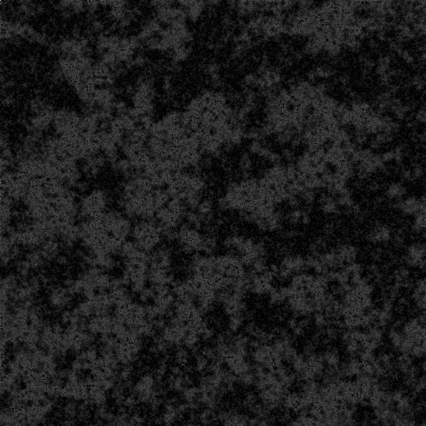
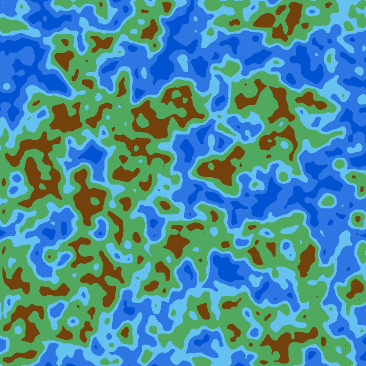

# gomap
Create maps from noise using GO, like this one:

Noise created using Diamond-Square algorithm:

Final image:

Todo:
 - More smoothing algorithms
 - More noise generators
 - Maybe making the grayscale -> color better?
 - Document the code
 - Create an actual program in `main.go`
 - Anything that crosses my mind